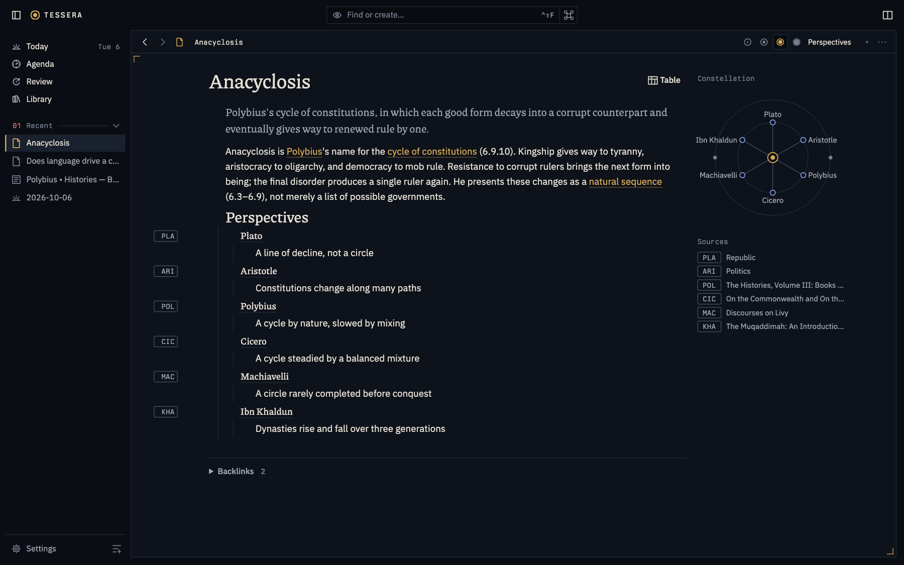
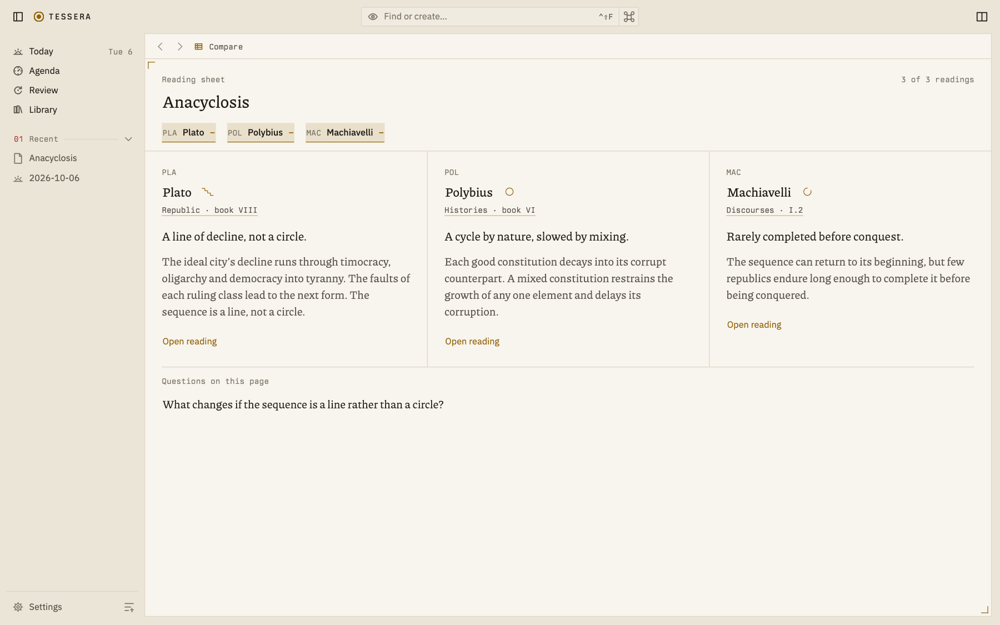
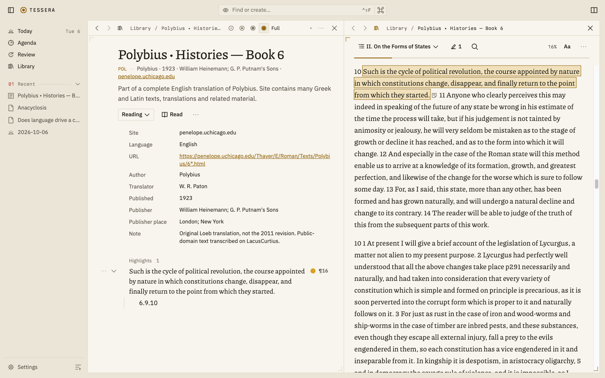
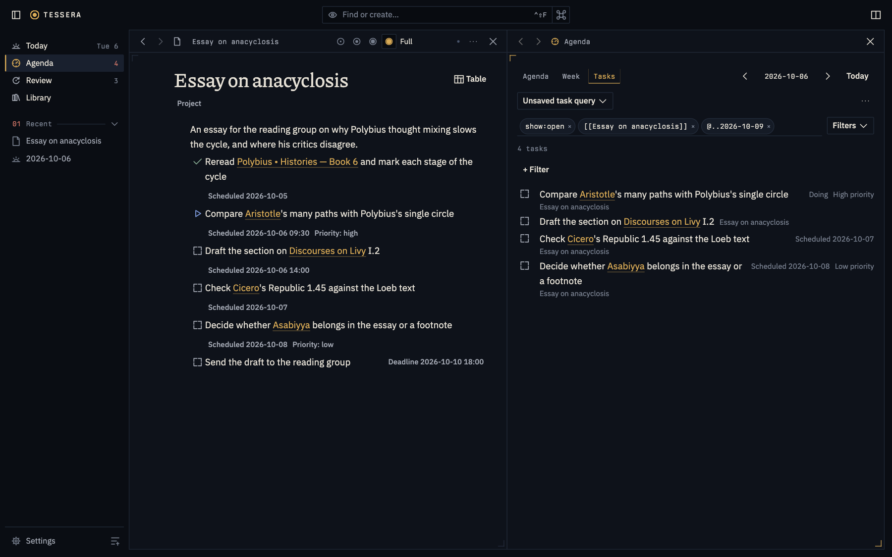
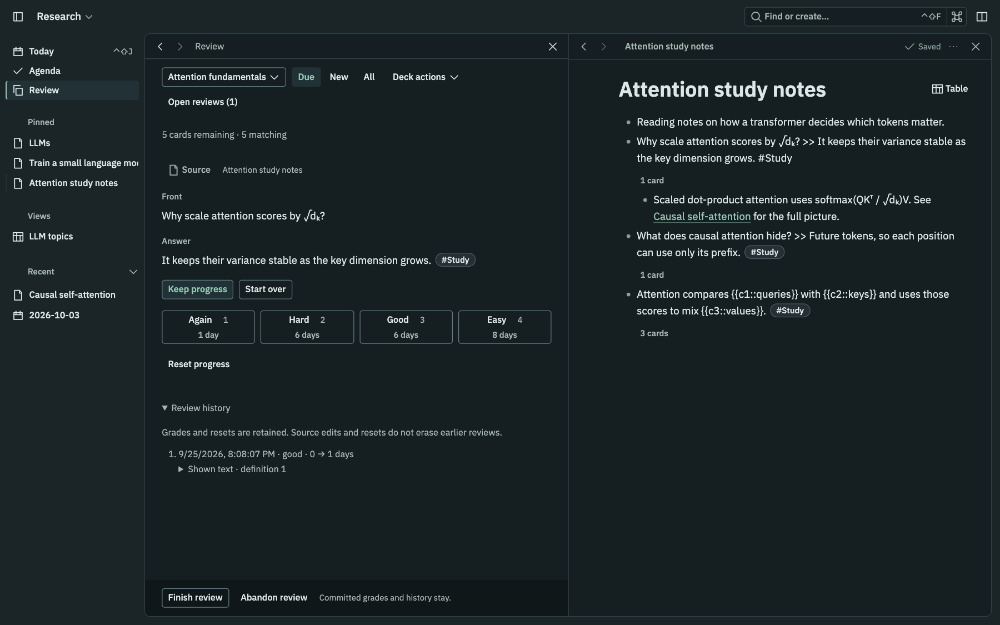

# Tessera

Tessera is a local-first outline workstation for notes, questions, evidence, tasks and study. You write in an outline of small addressable blocks. Each block is one tile; pages, journals, agendas, investigations and review sessions are different ways of arranging the same tiles.

Status: the daily outline, structure, action, learning, library and reading workflows are working. Pages, journals, references, search, fields, saved tables and two panes share operation-based autosave, undo and conflict handling. Tasks support planning, recurrence, projects, clocked work and historical agendas. Cards derive from authored notes and vocabulary, with query-backed decks, review sessions and retained scheduling history. EPUB books and web articles are ingested as immutable snapshots, read beside the outline, highlighted into cited blocks and exported as BibTeX or CSL JSON. Questions, perspectives and side-by-side comparison have started; capture and the rest of inquiry follow the [roadmap](docs/roadmap.md).

## Screenshots

The notebook below studies anacyclosis, Polybius's cycle of constitutions. Its quotations come from W. R. Paton's public-domain 1923 translation.

### Perspectives on one idea

Each thinker's position sits under the idea it answers, with its source's siglum in the margin and a constellation of every holder beside the page.



### Compare positions

Compare presents selected readings side by side, with source sigla, shape marks beside the holders and each account's prose. Authored questions sit below the sheet; fields remain in the source outline.



### Read and cite sources

A source page sits beside its reader. Highlighting a passage writes an ordinary block on the source page that cites it.



### Tasks and agenda

Project tasks stay in their outline. In Agenda's Tasks view, one query line filters by project, state and dates, and each term becomes a removable chip. Add condition brings task, source and field filters into one searchable picker.



### Review beside the notes

Review a deck beside the notes its cards come from, on a quiet reading sheet with a compact grading strip, interval previews and the card's retained history.



## What it is for

- **Writing in outlines.** Nest, move, fold and zoom blocks with the keyboard or the mouse. Vim users get real Vim motions inside a block and structural commands across blocks.
- **Reusing thoughts without copying them.** A reference shows the original block's current text. Editing the original updates every place it appears.
- **Questions that change their answers.** An investigation keeps its dated assessments. Accepting a new answer supersedes the old one without erasing it.
- **Several accounts of one thing.** Sources, passages and attributed positions stay distinct, so disagreement is visible instead of averaged away.
- **Work and study attached to knowledge.** Tasks, schedules and flashcards live on the blocks they concern, with their history intact.
- **Agents as ordinary clients.** Command-line tools and language-model agents use the same checked operations as the editor. They never write to the database directly.

## Principles

1. Never lose work. Unsaved, saved, conflicted and superseded are different states, and the interface says which one applies.
2. Identity outlives wording. Moving, editing or referencing a block keeps its ID, its cards and its history.
3. Structure is added, not chosen up front. A block can gain a task, a question, a card or a type without becoming a different object.
4. Don't drop a frame. Typing, scrolling and navigation have explicit budgets, measured on large notebooks.
5. Quiet and keyboard-first, in a dark or light theme, with every action also reachable by a visible control.

## Documents

- [Vision](docs/vision.md): who it is for and what it must do.
- [Lessons](docs/lessons.md): what the prototype proved and what it got wrong.
- [Domain model](docs/domain-model.md): blocks, capabilities and their rules.
- [Architecture](docs/architecture.md): runtime, editor, storage and sync decisions.
- [Design](docs/design.md): the browser client's tokens, shell, rows, tables and popups.
- [Performance](docs/performance.md): budgets, the measured baseline and the spikes that decide the stack.
- [Roadmap](docs/roadmap.md): build order and exit criteria.

## Install

Build a self-contained binary with Rust (stable) and Bun:

```sh
bun install --cwd web --frozen-lockfile
bun run --cwd web build
cargo install --path crates/tessera-cli --features embed-web
tessera install
```

On macOS, `tessera install` starts a launch agent and opens the service at <http://127.0.0.1:4318>. Open that URL in a browser. The agent starts at login and restarts the service if it exits. It writes stdout and stderr to `~/Library/Logs/tessera/serve.log`. `tessera uninstall` stops the agent and removes its plist, not the notebook. Install and uninstall are macOS-only; on Linux run `tessera serve` directly.

To choose a notebook or port, use `tessera --notebook /absolute/path/to/notebook install --port 4397`. `TESSERA_NOTEBOOK` also persists that notebook choice in the agent. Without either, the service uses the platform data directory. Install refuses a binary under `target/debug` unless `--allow-debug` is given.

The `embed-web` feature compiles `web/dist` into the binary. `tessera serve` needs no `--assets` flag; `--assets web/dist` still overrides the embedded editor during development. Builds without that feature serve only the API unless given `--assets`. The service remains loopback-only.

Logs go to stderr through `tracing`. `RUST_LOG` selects the filter, defaulting to `info`; the launch agent sets `RUST_LOG=info`. CLI JSON and exports remain on stdout.

### Shipping a build

`scripts/ship [commit]` makes a commit (default `HEAD`) the installed app on this Mac. It builds in a separate worktree under `~/Library/Caches/tessera/ship`, so uncommitted edits never ship. It backs up the live notebook (listed under Settings → Backups), copies the binary to `~/.local/bin/tessera`, reinstalls the launch agent on port 4318 and waits for the new build to answer. Settings shows the build's commit. If the new build does not answer within 20 seconds, the script puts back the previous binary, restores the backup and exits with an error.

### Backup and restore

```sh
tessera backup /path/to/new-backup
tessera info --notebook /path/to/new-backup
tessera --notebook /path/to/restored-notebook restore /path/to/new-backup
```

Backup can run while the service is running. Its destination must be empty. It contains an online SQLite snapshot (`notebook.db`), immutable `objects/` files and `manifest.json` with the notebook ID, schema version, backup timestamp, object count and database page count. Restore preserves notebook identity and checks migrations. Stop the destination service first. Restore refuses a non-empty destination unless `--force` is passed; that flag never bypasses a live service lock.

## Development

Requires Rust (stable) and Bun.

```sh
bun install --cwd web
bun run --cwd web build
cargo run -p tessera-cli -- --notebook .tessera/dev serve --port 4320 --assets web/dist
```

Open <http://127.0.0.1:4320>. Port 4318 belongs to the installed app. Without `--notebook` (or `TESSERA_NOTEBOOK`), the notebook lives in the platform data directory under `tessera/notebook`. A missing notebook is created; an existing one is never overwritten.

For live reloading, run the service with `--dev-origin http://127.0.0.1:5173` and `bun run --cwd web dev` in a second terminal, then open <http://127.0.0.1:5173>.

The service binds to loopback only and rejects other hosts and browser origins. `tessera info` prints the notebook's identity as JSON.

Checks: `cargo fmt --all --check`, `cargo clippy --workspace --all-targets -- -D warnings`, `cargo test --workspace`, and `bun run --cwd web build`. Backend budgets: `cargo run --release -p tessera-bench -- --root /tmp/tessera-bench --fail-on budgets`.

### Browser demo

<https://tessera.solforged.io> runs the real notebook engine in the browser: `tessera-core` and the service's notebook and library routes compile to wasm (`crates/tessera-web`) and run in a worker over SQLite in the browser's private storage. The tour seeds a public-domain EPUB from Project Gutenberg (Marcus Aurelius' *Meditations*, `web/src/demo/meditations.epub`) for the library and reader, and visitors can upload their own EPUBs. Web articles, backups and service details are left out. Build it with `rustup target add wasm32-unknown-unknown`, `rustup component add llvm-tools` and `cargo install wasm-bindgen-cli --version 0.2.129 --locked`, then:

```sh
scripts/build-demo-wasm.sh
bun run --cwd web build:demo
```

The output in `web/dist-demo` is static; serve it with every non-asset path rewritten to `demo.html` (see `web/vercel.json`). `.github/workflows/demo.yml` builds and deploys it to Vercel on each push to `main` once the `VERCEL_TOKEN`, `VERCEL_ORG_ID` and `VERCEL_PROJECT_ID` secrets exist.

## Acknowledgments

Tessera borrows ideas from tools and thinkers its author admires:

- **Outliners with addressable blocks**, such as Logseq, Roam Research, RemNote, and Tana: outline-first writing, journal days, block references and backlinks.
- **org-mode and org-roam:** scheduled and deadline dates, repeaters, an agenda and clocked work connected to notes.
- **Vannevar Bush's memex:** associative trails that keep the context of discovery close.
- **SuperMemo and SM-2,** and **Anki's** four-grade review.

## License

[MIT](LICENSE).
