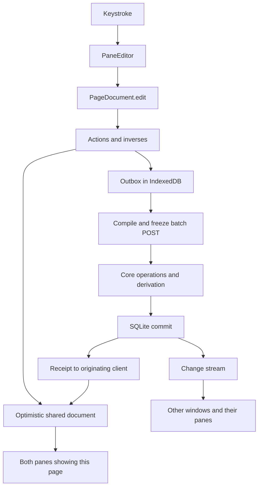

# How Tessera works

Tessera stores an outline in SQLite. The browser keeps an optimistic document, then sends revision-checked operations to the local service. This guide follows the implementation; [architecture](architecture.md), [domain model](domain-model.md) and [design](design.md) explain the intended structure and rules.

## The shape in one page

The CLI runs the service; each browser window creates its own notebook client. `tessera serve` calls `tessera_service::serve` in the CLI process. With `embed-web`, the built editor is compiled into that binary, so no asset directory is needed at runtime. `--assets` overrides the embedded files for development. `tessera install` runs the service as a macOS launch agent; `uninstall` removes the agent without deleting data. `info` reads notebook identity directly; `add` and `export` discover an already-running service through `service.lock`. There is no automatic service-starting command dispatcher. See `crates/tessera-cli/src/main.rs`, `install.rs` and `crates/tessera-service/src/assets.rs`.

The service acquires `service.lock`, opens the notebook and binds to loopback. Its `AppState` holds one `Notebook` behind `Arc<Mutex<Notebook>>`. That notebook owns one SQLite connection. **Reads and writes currently share this connection and mutex**; the read pool described in the architecture document is not in this implementation. See `crates/tessera-core/src/ownership.rs`, `NotebookOwnership::acquire`, `crates/tessera-service/src/lib.rs`, `serve` and `run`.

The database is `notebook.db` inside the notebook directory. `Notebook::open` enables WAL, `synchronous=FULL` and foreign keys, then runs migrations. The singleton `notebook` row supplies the notebook ID used to namespace browser recovery data. See `crates/tessera-core/src/notebook.rs:10`, `Notebook::open` and `Notebook::info`; `crates/tessera-core/migrations/001_notebook.sql`.

Every CLI command initializes `tracing` on stderr with a `RUST_LOG` filter, defaulting to `info`. Service events include its URL, notebook path, applied migration versions, ingestion job starts and outcomes, and shutdown. The macOS launch agent sets `RUST_LOG=info` and writes both output streams to `~/Library/Logs/tessera/serve.log`. CLI JSON and exports still go to stdout.

`tessera backup <dest>` opens a fresh read connection and uses SQLite's online backup API while the service can keep writing WAL commits. It copies published content-addressed objects and writes a manifest with notebook ID, schema version, backup time in Unix milliseconds, object count and database page count. The destination must be empty. `tessera --notebook <dest> restore <src>` holds the service ownership lock throughout replacement and migration checks. A live service always prevents restore, even with `--force`; that flag only permits a non-empty destination. Immutable objects already present are retained. See `crates/tessera-core/src/backup.rs` and the [install instructions](../README.md#install).



The input half lives in `web/src/outline/editor.ts` (`PaneEditor`), `web/src/outline/OutlinePane.tsx:1070` and `web/src/document/page-document.ts` (`Document.edit`, `apply`). The durable half lives in `web/src/document/index.ts` (`enqueue`, `compile`, `drain`), `web/src/document/outbox.ts` and `crates/tessera-core/src/operations.rs` (`Notebook::apply`).

A successful batch commits authored rows, derived indexes and its change receipt together. The service then broadcasts the sequence number while holding the notebook lock. The POST returns the receipt; WebSocket consumers fetch committed changes after their cursor. See `crates/tessera-core/src/operations.rs:22` and `crates/tessera-service/src/lib.rs:447`, `catch_up`, `stream_changes`.

Two panes in one window share the same `Document` when they open the same page ID. A second window has a separate `Notebook` client and learns about changes through HTTP catch-up and the WebSocket stream. See `web/src/document/index.ts:162`, `reconcileConnection` and `change`; `web/src/shell/App.tsx:504`.

## Blocks and the outline

Every page, journal day and ordinary outline row is a row in `blocks`. There is no separate page-content table. A page root's `text` is its title; a journal root's `text` is its date. See `crates/tessera-core/migrations/002_outline.sql:18` and `crates/tessera-core/src/model.rs:13`.

| Column | Stored meaning |
|---|---|
| `id` | Stable block identity; operations use this ID rather than a row position |
| `kind` | `page`, `journal` or `block` |
| `parent_id` | Immediate outline parent; null for roots |
| `page_id` | Owning root; equal to `id` on roots |
| `ordinal` | Integer sibling-order key |
| `text` | Authored source text, or root title/date |
| `title_key` | Lowercased page title for lookup and uniqueness; null on other kinds |
| `heading` | Null or heading level 1, 2 or 3 |
| `archived` | Boolean flag on this row |
| `revision` | Positive revision of this block's stored state |
| `deletion_id` | Null while live; deletion-event ID when tombstoned |
| `created_at`, `updated_at` | Stored millisecond timestamps |

The schema constrains roots and ordinary blocks and indexes siblings by `(parent_id, ordinal, id)`. Live page titles are unique by `title_key`; live journal roots are unique by date text. The public `Block` response omits `ordinal`, `title_key` and `deletion_id`. See `crates/tessera-core/migrations/002_outline.sql:32` and `crates/tessera-core/src/model.rs:26`.

Sibling order uses sparse integers. An insertion chooses the midpoint between neighbors, or adds/subtracts a gap of 1024 at an end. When no gap remains, the engine renumbers siblings, including tombstones, without bumping their authored revisions. See `crates/tessera-core/src/operations.rs:797` (`Engine::ordinal`).

An insert takes `parent_id` and `after`, not an ordinal supplied by the browser. The engine checks that `after` is a live sibling and copies the parent's `page_id`. A move changes the moved row's parent, page and ordinal. When it crosses pages, the engine updates `page_id` and revisions throughout the subtree. Cycles and root moves are rejected. See `crates/tessera-core/src/model.rs:67`, `Operation::Move`; `crates/tessera-core/src/operations.rs:871`, `Operation::Insert` handling.

A page read fetches live rows once, groups them by parent, then walks them in preorder. Its response has a root plus rows with computed depth; depth is not a database column. It also carries manual memberships, external reference targets and capability sidecars. See `crates/tessera-core/src/reads.rs:72` (`Notebook::page`).

A revision belongs to one resource, not to the whole notebook. New blocks start at 1. A changed text, heading, archive flag, location or capability can bump the block revision; an equal-text edit does not. Several operations in one batch can bump the same block several times. The receipt records its final revision once. The notebook-wide `changes.seq` is a separate commit cursor. See `crates/tessera-core/src/operations.rs:241`, `create`, `edit`, `bump` and `operation`; `crates/tessera-core/migrations/002_outline.sql:1`.

For an existing block, `base_revision` must equal the stored revision at that operation's position in the batch. `Engine::checked` returns a conflict containing the operation index, ID, expected revision and found revision. A deleted or missing row yields no live revision. The transaction rolls back on failure; the service maps this conflict to HTTP 409. See `crates/tessera-core/src/operations.rs:572`, `Notebook::apply`; `crates/tessera-service/src/error.rs:49`.

`Operation` is the write vocabulary. It includes text edits, split, merge, move, delete/restore, fields, types, tasks, work and review operations. Merge checks both source and destination revisions. Restore names the deletion event and the deleted block's revision. See `crates/tessera-core/src/model.rs:55` (`Operation`).

Deletion tombstones the live subtree under one event. Restoration revives only rows carrying that event, so it does not resurrect independently deleted descendants. Archiving leaves rows live; discovery queries compute hidden descendants from archived ancestors. Direct block and page reads still include archived blocks. See `crates/tessera-core/src/operations.rs:707`, `restore`; `crates/tessera-core/src/reads.rs:49`, `block`, `page`.

## Text is the source of truth for some things

Text writes rebuild the affected reference and membership indexes and reconcile affected fields and card definitions. They do not rebuild the entire notebook on every keystroke. Links derive during create/edit; tag, card and field work finishes inside the batch transaction. See `crates/tessera-core/src/operations.rs:89`, `create`, `edit`, `derive_tags`, `derive_cards`; `crates/tessera-core/src/fields.rs` (`FieldChanges`).

| Source | Parser or recognizer | Derived state |
|---|---|---|
| `[[id]]`, `[[id\|alias]]` | Core `storage.rs::derive_links`; browser `text-tokens.ts::textTokens` | `links` rows for recognized ID references |
| `#Type`, `#[[Type name]]` | Core `storage.rs::tag_tokens`, `derive_memberships`; browser `textTokens` | `memberships` rows with `manual=0` |
| Whole `[[field-id]]` entry with children | Core `fields.rs::reference`, `derive_owner` | `field_values` identity/order rows |
| `Name:: value` | Browser `table/query.ts::matchFieldEntry`, `OutlinePane.tsx::commitFieldEntry` | Authored reference entry and child value blocks, then `field_values` |
| `front >> back`, `front << back`, `front <> back`, numbered clozes | Core `card_text.rs::parse_card_text`; browser `review/card-text.ts::parseCardText` | Retained `card_units` definitions |
| Searchable text | SQLite FTS triggers | `blocks_fts`, with live candidates in `search_blocks` |

The table's implementations are in `crates/tessera-core/src/storage.rs:143`, `295`; `crates/tessera-core/src/fields.rs:94`, `185`; `web/src/document/text-tokens.ts:2`; `web/src/table/query.ts:47`; `crates/tessera-core/src/card_text.rs:292`; `crates/tessera-core/migrations/002_outline.sql:62`.

References address IDs. `derive_links` stores each recognized occurrence and optional alias; the target deliberately has no foreign key, so an unresolved reference can remain in source text. A tag's bracketed title is excluded from the link index. Backlinks return distinct visible source blocks, not one result per occurrence. See `crates/tessera-core/src/storage.rs:143`, `crates/tessera-core/migrations/002_outline.sql:52` and `crates/tessera-core/src/reads.rs:213`.

The browser displays a reference's alias or current target text through `Notebook.lookup`. It shows an unresolved label when the target is missing. The authored ID token remains in the source; rendering the target title does not rewrite it. See `web/src/outline/BlockText.tsx:22`, `referenceLabel` and `BlockText`.

Opening a non-journal page selects a visible non-field row without editing it. In an active row, CodeMirror shows single-line references as atomic labels until the caret enters their source text. Clicking a label exposes the token. Arrow keys step over labels, and Backspace immediately after one deletes the whole token. Multiline references remain raw. HTTP and HTTPS URLs render as external links in outline rows and table cells, with trailing punctuation excluded and balanced parentheses retained. URL rendering does not add core link-index entries. See `web/src/outline/editor.ts`, `web/src/document/text-tokens.ts` and `web/src/outline/BlockText.tsx`.

Tags address page titles. Derivation lowercases the title for matching, deduplicates text memberships and creates a missing type page on a live tag write. A type-page rename can rewrite incoming tag spellings and manual-membership titles. The receipt includes `text_rewrites` for the browser and undo history. See `crates/tessera-core/src/storage.rs:295`, `resolve_type`; `crates/tessera-core/src/operations.rs` (`prepare_tag_rename`, `rewrite_incoming_tags`, `derive_tags`); `web/src/document/page-document.ts` (`recordRewrites`).

**`Name:: value` is a browser input conversion, not a core shorthand parser run on every write.** Enter, blur and several navigation paths call `commitFieldEntry`. It finds or creates a field definition, rewrites the entry to `[[field-id]]`, and inserts the value as a child. A raw API text write containing `Name:: value` stays raw until a client converts it. See `web/src/outline/OutlinePane.tsx:60`, `214`, `541`, `1072`; core `fields.rs::derive_owner` recognizes only a whole reference.

The shorthand matcher limits names to 60 characters and excludes reference/tag/code delimiters. It checks the name with the card parser before converting, so a cloze draft or card source is not mistaken for a field name. Card syntax in the value is preserved. See `web/src/table/query.ts:47` and `web/src/table/query.test.ts` (`matches names`, `keeps cards`, `retains card and code syntax`).

Cards use one direction operator per source block, or numbered clozes such as `{{c1::answer::hint}}`. `>>` makes a forward unit, `<<` a reverse unit, and `<>` both. Repeated cloze numbers form one unit; its front masks that group's answers and reveals the other groups. Invalid explicit card syntax returns problems and no units. Code, references and escaped syntax are shielded by the card parsers. See `crates/tessera-core/src/card_text.rs:55`, `protected_end`, `cloze`, `parse_card_text`; `web/src/review/card-text.ts:149`.

Derived rows have different replacement rules. Links are deleted and reinserted for the source. Only text memberships are replaced; manual memberships survive. Field-value rows are cleared and reinserted for affected owners. Card rows retain identity and schedule; missing syntax deactivates a unit rather than deleting its history. See `storage.rs::derive_links`, `derive_memberships`; `fields.rs::derive_owner`; `card_store.rs::derive_sources` in `crates/tessera-core/src/`.

## Fields and types

A field is a definition block under the live page titled `Fields`. A field entry is a child block of an owner; its whole text references that definition. Value blocks are children of the entry. The field index stores these identities, not another copy of value text. See `crates/tessera-core/src/fields.rs:62`, `reference`, `derive_owner`; `crates/tessera-core/migrations/006_fields_views.sql:23`.

For example, the authored outline can contain:

```text
Fields
  Author                       [definition block]
  Published                    [definition block]
Dune #[[Book]]                  [owner block]
  [[Author-definition-id]]      [entry block]
    Frank Herbert              [value block]
  [[Published-definition-id]]
    1965
```

The labels above stand for real block IDs. The indexed tuple is `(owner_id, field_id, entry_id, value_id, ordinal)`. Several entries and several value children can contribute to one field. Empty entries have no value rows but remain recognizable through their whole reference. See `crates/tessera-core/migrations/006_fields_views.sql:23`; `crates/tessera-core/src/fields.rs:185`; `crates/tessera-core/src/query.rs:368`.

Definitions have a name in block text and an optional kind row in `fields`. Without a row, the kind is `text`. Kinds are text, number, date, checkbox, choice, instance, url and identifier. Choice options are live, unarchived child blocks of the definition. Definition recognition excludes blank, deleted and archived definition blocks. See `crates/tessera-core/src/fields.rs:62`, `definitions`; `crates/tessera-core/migrations/006_fields_views.sql:1`, widened by `010_field_kinds.sql`.

`FieldKind::ALL` and its string mapping in `model.rs` define the ordered kind contract. Database reads reject an unknown stored kind as corruption rather than treating it as text. Tests in `tests/fields.rs` insert every kind through SQLite's CHECK, reject a bogus kind and compare the order against `web/src/fields/kinds.ts::fieldKinds`. The web API type derives from that array, and `kindLabels` is exhaustive. Historical migrations keep their original CHECK definitions.

Values remain authored text. `fields::reading` interprets them using the field's current kind when queried. It parses numbers, accepts full or partial (`YYYY`, `YYYY-MM`) date text or a journal reference, recognizes checkbox spellings, checks choice references against option children, resolves instance references, checks `http(s)` URLs and normalizes identifiers (`fields::identifier`: ISBN-10 converts to ISBN-13 after both checksums, DOIs lowercase, arXiv keeps its version). Invalid values return a problem reading; the source text is retained. See `crates/tessera-core/src/fields.rs:351`.

A type is an ordinary page used as the target of memberships. `memberships` records the block, normalized title, resolved page ID, authored spelling and source flag. Text and manual memberships have separate rows and can coexist for the same block/title. Removing a manual membership does not remove a tag from text. See `crates/tessera-core/migrations/007_manual_memberships.sql`; `crates/tessera-core/src/operations.rs` (`Operation::AddType`, `RemoveType`); `web/src/document/page-document.ts:818`.

`type_fields` is an ordered list of field IDs attached to a type page. `SetTypeFields` validates definitions, replaces that list and bumps the type page's revision. The template supplies initial table columns; it does not itself create value blocks. See `crates/tessera-core/migrations/006_fields_views.sql:6`; `crates/tessera-core/src/operations.rs:1158`; `crates/tessera-core/src/query.rs:92`, `312`.

Tables query stored sources and field readings. `Notebook::query_sources` gathers candidates by type membership, FTS text and field-entry ownership. A joined read fetches source blocks, page roots, value text and reference targets. It filters and sorts readings in Rust, counts matches, then applies the result limit. See `crates/tessera-core/src/query.rs:162`, `203`, `272`; `crates/tessera-core/src/reads.rs:186` for the simpler member read.

`present` means an entry exists. `set` means at least one nonblank value appears in the query response; `empty` means none does. A nonblank invalid value still counts as set, but ordinary comparisons require a valid reading. A field sort uses the first value's reading; missing/problem keys sort last. See `crates/tessera-core/src/query.rs:250`, `PreparedFilter::matches`, `compare`, `sort_value` and sorting at `286`.

A table edit changes those same outline blocks. It edits the first existing value, or finds/creates the reference entry and reuses/inserts a child value. Saved table views store a name, JSON `Query` and their own revision in `views`. See `web/src/table/TablePane.tsx:219`; `crates/tessera-core/migrations/006_fields_views.sql:14`; `crates/tessera-core/src/query.rs` (`stored_view`, `views`, `view`).

## Tasks, projects and work sessions

Task and project state is retained metadata keyed by block ID. It is not encoded in the block's text or field children. The owning block can be a root or an ordinary outline row; capability writes check that block's revision. See `crates/tessera-core/migrations/009_action_learning.sql:1`; `crates/tessera-core/src/operations.rs:1264`; `crates/tessera-core/src/task_store.rs:301`.

| Table | Columns outside JSON | JSON payload |
|---|---|---|
| `tasks` | `block_id`, `active` | `state`: status, scheduled/deadline dates and times, warning days, repeater, priority, completion date |
| `projects` | `block_id`, `active` | `state`: outcome, deadline, status |
| `task_occurrences` | ID, block, completion date, reversal flag, timestamps/change sequences | `snapshot` before completion, `after_state` after completion |
| `work_sessions` | ID, block, start/end timestamps, note, reversal flag, revision, creation/update sequences | None |

The schema is `crates/tessera-core/migrations/009_action_learning.sql:1`. Payload definitions are `TaskState`, `ProjectState`, `TaskOccurrence` and `WorkSession` in `crates/tessera-core/src/capabilities.rs:28`.

`active` means the block currently has that capability. It does not mean an unfinished task or active-status project. Removing a task/project sets `active=0` and retains its row and prior state. Setting it again reactivates the row. A done task can still have `active=1`. Semantic no-op metadata writes do not bump the owning block. See `crates/tessera-core/src/task_store.rs:79`, `set_project`, `complete_task`; `crates/tessera-core/src/operations.rs:1279`.

Task statuses are `todo`, `doing`, `waiting`, `done` and `cancelled`. Completion must go through `CompleteTask`; ordinary task metadata cannot invent a new done state. The engine records one occurrence with the prior state, then stores the resulting state. Without a repeater, it sets done and the completion date. Completing an already-done nonrepeating task is a no-op. See `crates/tessera-core/src/capabilities.rs:10`; `crates/tessera-core/src/task_store.rs:109`, `190`.

**Completing a parent task leaves its children untouched.** Completion updates only the selected task row and inserts its occurrence. It does not check child statuses, complete children, block completion on children or roll child progress into the parent. There is no task-parent or dependency field in `TaskState` or the task schema. Outline nesting remains, but it supplies no parent/child task-completion rule. See `crates/tessera-core/src/task_store.rs:190`, `crates/tessera-core/src/capabilities.rs:28` and `crates/tessera-core/migrations/009_action_learning.sql:1`.

Projects use outline ancestry for query association. A task's displayed `project_id` is its nearest ancestor with an active project capability. Filtering by a project includes descendant tasks through an ancestor query. Project status is separate metadata; this query checks the capability's `active` flag, not a completion roll-up. See `crates/tessera-core/src/task_query.rs:76` (`visible_tasks`); `crates/tessera-core/src/task_store.rs:162`.

Repeaters store a positive interval, day/week/month/year unit and mode. Completion advances the scheduled date, or the deadline if no scheduled date exists. If both exist, it preserves their day separation. Clock labels stay unchanged. The task becomes todo again and clears `completed_on`; the occurrence still records the completion. See `crates/tessera-core/src/calendar.rs:11`, `Repeater`, `advance_window`; `crates/tessera-core/src/task_store.rs:214`.

Fixed mode advances one interval from the old planning anchor. Catch-up chooses a later anchored occurrence strictly after completion. After-completion mode advances from the completion date. These are civil-date calculations in core, not browser scheduling predictions. The optimistic client leaves a repeating task's state unchanged until the authoritative receipt arrives. See `crates/tessera-core/src/calendar.rs:144`; `web/src/document/page-document.ts:179`.

Reversing completion restores the exact saved task snapshot and marks the occurrence reversed. Only the latest unreversed occurrence can be reversed, and the current state must still equal its recorded `after_state`. This prevents undo from overwriting later task edits. See `crates/tessera-core/src/task_store.rs:248`.

### Task lists and agenda

Task queries compute a view from active, visible task sources. Optional source selection reuses the type/text/field query without its intermediate limit. Filters then apply task status, selection, date ranges, priority and project ancestry. Unfinished means todo, doing or waiting. The default selection also admits tasks with unreversed occurrences in the recent window; cancelled tasks require an explicit cancelled-status filter. See `crates/tessera-core/src/task_query.rs:111`, `284`; defaults in `crates/tessera-core/src/capabilities.rs:182`.

Task rows sort by planning date, planning time, priority and block ID. The planning key prefers scheduled date to deadline; missing dates/times come last. The total is counted before the outer limit. Saved task views store the JSON task query in `task_views`. See `crates/tessera-core/src/task_query.rs:139`, `156`, `216`, `339`; migration `009_action_learning.sql:67`.

The agenda is calculated for a displayed civil date. Unfinished tasks contribute scheduled, deadline, warning, overdue or unplanned reasons. For a task completed that day, the latest unreversed same-day occurrence supplies historical planning and a projected done row, including for a repeater already advanced to its next date. Currently cancelled tasks are excluded. See `crates/tessera-core/src/task_query.rs:165`, `348` (`Notebook::agenda`).

### Work sessions

Work sessions are timestamped audit rows attached to task sources. Starting requires an active, visible, unfinished task. A partial unique index permits only one unreversed running session in the notebook. Start/stop times come from the operation; delayed delivery does not replace them with commit time. See `crates/tessera-core/src/work_store.rs:67`, `83`, `129`; `crates/tessera-core/migrations/009_action_learning.sql:27`.

Stopping sets `ended_at` and the note. Note edits and reversal/reopening update the session's own revision; the operation also checks and bumps the owning block. Reopening must still satisfy the unfinished-task and free-clock checks. History reads include reversed and hidden/deleted sources. See `crates/tessera-core/src/work_store.rs:107`, `apply`, `work_sessions`; `crates/tessera-core/src/operations.rs:1298`.

A running clock prevents completion, removal or cancellation of its own task until stopped. Hiding a subtree containing a running clock, or moving it beneath a hidden source, is also refused. The browser completion edit can queue `StopWork` immediately before `CompleteTask` when supplied the current session. See `crates/tessera-core/src/task_store.rs:59`, `149`, `213`; `crates/tessera-core/src/work_store.rs:243`; `web/src/document/page-document.ts:782`.

### Why a row cannot merge away

`mergeProtected` protects a source block whose identity carries something a merge would strand. Core sets `merge_protected` when the block has an active task, an active project, a non-reversed task occurrence, a non-reversed work session, or a review event on one of its cards. An inactive task or project row with no history does not protect; a block that was briefly a task merges like any other. Review events count even when the card's syntax is inactive. The flag is computed in reads, not stored as a `blocks` column, and capabilities also carry `history` (occurrences or work sessions exist). See `crates/tessera-core/src/task_store.rs` (`capability_rows!`, `capability_at`, `guard_merge`).

The browser maps that sidecar into `BlockState.mergeProtected` and keeps `history` in the document cell, recomputing protection after every task, project, completion and work action, on receipts and in offline replay. Optimistic reversal keeps history until the service reports otherwise, because the client cannot know whether other evidence remains. Page loads, receipts, stream events and the recovery cache carry capability sidecars. See `web/src/document/page-document.ts` (`receiveCapabilities`, `apply`); `web/src/document/outbox.ts` (`cachedPage`).

A `merge` edit on a protected source is refused with "This task has completion or work history; delete it or keep it separate." when history exists, otherwise "Cannot merge away an active task, project, or reviewed card." A cross-block range replacement whose last endpoint would merge away a protected block is refused the same way. Backspace at the start of a task never reaches that guard: `boundaryDeletion` deletes an empty childless todo and removes the task state from a non-empty one first. Forward Delete can still meet it when the next row is an active task. See `web/src/document/page-document.ts` (`merge`, `replace`); `web/src/document/outline-mechanics.ts` (`boundaryDeletion`); `web/src/outline/OutlinePane.tsx` (`backspace`).

Core enforces the rule for API clients too. `Engine::merge` calls task/project and reviewed-card merge guards before changing anything. The destination may retain its identity; protection concerns the source being merged away. This flag does not prohibit ordinary text edits, moves, archive or tombstone deletion; those have their own checks, including the running-work guard. See `crates/tessera-core/src/operations.rs:909`, `delete`, `Operation::SetArchived`; `crates/tessera-core/src/task_store.rs:401`; `crates/tessera-core/src/card_store.rs:212`.

## Cards and review

A card unit is a retained definition derived from an ordinary block's text. It has its own ID, source ID and role key: `forward`, `reverse` or `cloze:cN`. `(source_block_id, key)` is unique. Root titles do not create cards. See `crates/tessera-core/migrations/009_action_learning.sql:41`; `crates/tessera-core/src/card_text.rs:359`; `crates/tessera-core/src/card_store.rs:90`.

Derivation compares parsed units with existing units by key. Wording changes update front/back and bump `definition_revision` and card revision while keeping the ID and schedule. Removed syntax deactivates units; reintroduced syntax reuses retained units. New keys get new IDs and an initially due schedule. See `crates/tessera-core/src/card_store.rs:117`, `derive_sources`.

The operation engine collects changed card sources and derives them once at batch end. Before grading/resetting in the same batch, it flushes preceding authored card edits so stale definitions fail the review check. Migration 009 backfills existing text once; reopening an already-current schema does not rebuild cards. See `crates/tessera-core/src/operations.rs:264`, `1313`; `crates/tessera-core/src/migrate.rs:35`, `70`.

A split at the end preserves card source identity. Splitting inside a current card is refused. Moving an entire card to the new half by splitting at the start is allowed only without review history. These are separate card split guards, not the task/project merge flag. See `crates/tessera-core/src/card_store.rs:221`; `web/src/document/page-document.ts:643`.

Scheduling state is JSON in `card_units.schedule`: ease factor, interval days, repetitions, lapses, due timestamp and last-review timestamp. Scheduler version 1 implements the SM-2 variant in `scheduler.rs`. New cards are immediately due. Again resets repetitions, adds a lapse and schedules one day; successful grades start with one and six days, then use the updated ease factor. Easy multiplies the interval by 1.3 before rounding. See `crates/tessera-core/src/scheduler.rs:8`, `SchedulingState`, `new_card`, `schedule`.

Reviews use card revisions, not source block revisions. `GradeCard` checks the card revision, definition revision and exact shown front/back. It also requires active syntax, a visible source and an open session when supplied. The scheduler uses the operation's explicit review time. See `crates/tessera-core/src/model.rs:235`; `crates/tessera-core/src/review_store.rs:134`, `172`, `402`.

Each grade/reset appends a review event with shown text, definition revision, scheduler version, before/after schedules, event time and change sequence. It updates the card schedule and card revision in the same transaction. Reset-plus-grade records reset and grade evidence separately. Finishing or abandoning a review changes the session state; it does not delete grades. See `crates/tessera-core/migrations/009_action_learning.sql:76`; `crates/tessera-core/src/review_store.rs:206`, `239`, `355`.

Decks are saved JSON card queries, with names and independent revisions. Their optional source query selects blocks using type/text/fields. Card queries then select active visible units by due/new/all, count before limiting and order reviewed units before new units, then by due time and ID. Deleting a deck deletes its query row, not source cards or review history. See `crates/tessera-core/src/card_query.rs:43`, `stored_deck`; `crates/tessera-core/src/review_store.rs:457`.

The review pane retains the shown card snapshot until acknowledgement. Refresh detects changed cards or sessions, and a stale card cannot be graded. Its current session filters out units already graded in that review. Grade/session/deck writes use durable notebook commands in the same ordered outbox as page edits. See `web/src/review/ReviewPane.tsx:127`, `240`; `web/src/document/index.ts:271`, `sendNotebook`.

## Library and reading

The library is a source capability on an ordinary page, not a parallel document tree. `SetSource`, `AttachSnapshot`, `Cite` and `Uncite` check the owning block revision and commit through the same batch engine as outline edits. Source state and active citations ride in capability sidecars on page loads, receipts and change events. Merging a cited block moves its citations to the destination; splitting retains them on the original ID. Tombstones keep evidence rows, while discovery reads exclude hidden or deleted citing blocks. See `crates/tessera-core/src/library.rs:1`, `library_store.rs:1` (`apply`), and `task_store.rs` (`capabilities_for`, `page_capabilities`).

The object store hashes original bytes and resource bytes with SHA-256. `Notebook::put_object` writes and syncs a temporary file beside its final object path, publishes it without replacing an existing object, then syncs the directories. `stage_snapshot` inserts the immutable snapshot, UTF-16-positioned passages, FTS entries and resource references in one transaction. The same hash returns the existing snapshot. See `crates/tessera-core/src/library_store.rs:1` and `migrations/011_library.sql:1`.

`plan_ingest` is a read-only operation planner. An explicit source target wins, followed by a matching EPUB unique identifier or article canonical URL, then a source already holding the same snapshot. New sources get a collision-safe title, an inbox state, a stable citation key, a Book or Article type and ordinary metadata field/value blocks. Creators normally reference ordinary person pages. An existing field keeps its kind: text receives plain extraction, instance and choice receive resolved references, and incompatible kinds retain the extracted string with an invalid reading rather than losing it. The service supplies the original URL or filename separately from immutable extracted metadata. See `crates/tessera-core/src/library_ingest.rs` (`Planner`, `plan_ingest`, `extracted_values`).

Extracted metadata lists are positional. Re-ingestion updates position `i` only when its current text still equals the previous extraction at `i`. A shorter list archives surplus still-extracted values, never deletes them. An empty list archives all still-extracted values. A longer list inserts missing positions after the last live value. Authored overrides are never changed or archived, and reading state and citation keys remain. Archived values do not occupy live positions on subsequent ingestion. The browser's “Reset to extracted” action uses the same positional comparison against the current snapshot, sets differing positions and inserts missing values. It leaves authored extras beyond the extracted list alone. The action is available from field block actions and source header actions whenever that reset plan is non-empty. See `web/src/outline/source.ts` and `source-fields.ts`.

Passage citations use a snapshot and two passage/UTF-16 endpoints. Reads compute the frozen quotation with blank lines between passages; passage search uses its own FTS index and current snapshots unless a source is explicitly requested. Reading coverage merges half-open passage-ordinal ranges and reports the covered UTF-16 fraction. Saving a position updates navigation state without adding a change row, except that the first read of an inbox source applies an attributed `SetSource` batch as `reader`. A citation jump must not save a reading position. See `crates/tessera-core/src/library_reads.rs:1`.

Library queries exclude inactive, hidden and deleted sources. Highlight triage defaults to a derived rule: a block is processed when it has live non-blank children, active card units or incoming links from live blocks. An empty note does not count. Migration 013 adds the nullable `citations.triage` column. Explicit `processed` or `unprocessed` takes precedence over the derived rule; null restores it. `SetCitationTriage` names the citation but checks and bumps its owning block revision. Capability sidecars carry triage for optimistic edits, undo and remote reconciliation. Highlight rows expose the citation's creation-change timestamp as `created_at`, independently of later block edits. BibTeX and CSL JSON export read current authored field readings rather than the stored extraction, and require an assigned citation key. See `crates/tessera-core/src/library_reads.rs` (`library`, `highlights`) and `library_export.rs`.

Reader selections snap partial words outwards using Unicode letters, digits and apostrophes, then trim whitespace, commas, semicolons and colons from both edges. The saved quotation and UTF-16 endpoints use that same range. Punctuation-only selections show no toolbar. Overlapping tints retain every citation and open a choice menu. Clicking a single tint or pressing Enter opens Open note or Add note, Make card, Copy with citation, explicit triage and Remove highlight. Shift-click opens the highlight beside the reader. Note, card, triage and removal edits use the document layer and its undo history.

The reader's Highlights picker filters this source's highlights to the open snapshot and lists them in reading order. Picking one scrolls to its passage and flashes the range without recording a reading position. The Library Highlights tab shows the covering chapter, or a one-based passage number, and the creation date in the notebook time zone. Row actions open the cited passage beside the library, manage notes and cards, set triage or remove the highlight. Chapter labels resolve against the citation's snapshot, including historical snapshots.

Highlights can use yellow, green, blue, red or purple, or null for the default tint. Selection keys 1–5 create coloured highlights; H and N keep the default. Migration 014 stores `citations.color`, and `SetCitationColor` checks and bumps the owning block revision just like triage. The highlight menu changes colour with document undo and appends ordinary `#tag` tokens through a text edit. Tags come from the highlight block's text-derived memberships, not the frozen quotation. The Library Highlights tab shows colours and tags, matches any selected colour and every selected tag, and keeps those filters in pane history.

Export supports valid text, number, date, URL, identifier, instance and choice readings for the known bibliography labels. Numbers keep their authored formatting. Dates keep their authored precision (`YYYY`, `YYYY-MM` or `YYYY-MM-DD`); journal references resolve to their date. Instance and choice references export the target title. Identifiers use their normalized ISBN, DOI or arXiv scheme. Checkbox readings are deliberately excluded, as are invalid readings and labels without a bibliography mapping. `tests/library.rs::export_field_kind_matrix` covers every kind in both BibTeX and CSL JSON.

Markdown export reads current authored titles, authors, publication dates, URLs and citation keys. It includes frozen highlight quotations in passage and offset order, with current-snapshot highlights first and older citations under `Earlier snapshot`. Chapter names resolve against each citation's snapshot, with a one-based paragraph number when no chapter covers it. Creation dates use the notebook time zone. Live non-blank note children follow in outline order, with nested notes as indented lists. Empty sources keep their header and a no-highlights message. Multiple sources are separated by `---`. Library, saved-view and source menus offer `.md` downloads alongside BibTeX and CSL JSON; the service returns `text/markdown; charset=utf-8`.

Library views persist a name, query and revision in `library_views`. `SaveLibraryView` and `DeleteLibraryView` use the same revision checks, batch receipts and change events as task views. The Library lists these beside its built-in tabs and restores the selected view after reload. Selection stays in the pane and clears when the query changes. Selection exports use source IDs; `POST /api/library/export` exports every source matching a query, without the displayed-row limit. An empty query result exports no sources. See `crates/tessera-core/src/library_views.rs`, `library_export.rs` (`export_query`) and `web/src/library/LibraryPane.tsx`.

Snapshot passage responses include that snapshot's Contents, including historical snapshots. The job list keeps queued, running and failed jobs regardless of age, plus completed jobs from the last 24 hours. Rows show the attempt count and scheduled retry time in the notebook time zone. Failed jobs keep their Retry action after reload.

The service exposes uploads, persistent ingestion jobs, sources, passages, resources, position, search, triage and export under `/api/library`, `/api/sources`, `/api/snapshots`, `/api/passages/search` and `/api/highlights/query`. Uploads alone accept 256 MiB; other request bodies keep the 2 MiB limit. One worker resumes running jobs as queued, downloads HTTP(S) sources with a 30-second timeout, five-redirect and 32 MiB limits, and extracts off the async runtime. Article images are limited to 60 resources of 10 MiB each; failed image fetches are skipped. Resource responses serve only image media types with immutable private caching and `nosniff`. Transient downloads receive three retries; extraction and 4xx failures stop immediately. See `crates/tessera-service/src/library.rs:1` and `crates/tessera-core/src/library_jobs.rs:1`.

`tessera add <path-or-url>...` queues work through the running service; `--wait` prints completed source titles or failed-job errors. `tessera export --format bibtex|csl|markdown [SOURCE_ID...]` prints the selected sources, or all active visible sources when no IDs are supplied. See `crates/tessera-cli/src/main.rs:18`.

`tessera export --view "Reading list" --format csl` resolves a saved library view by name and exports its query through the POST endpoint. A view name and source IDs cannot be combined. Duplicate view names are reported rather than choosing one silently.

## The client document layer

The client separates intent, optimistic actions, acknowledged state and delivery. One `Notebook` owns the window-wide queue, documents, roots and reference cache. Each `Document` owns one page's local cells, acknowledged blocks, outline indexes and undo/redo history. See `web/src/document/index.ts:27`; `web/src/document/page-document.ts:35`.

| File | Responsibility |
|---|---|
| `web/src/document/contract.ts` | Public `Edit`, `PageDocument`, `NotebookClient`, `BlockState` and save-state contract |
| `web/src/document/types.ts` | Actions, snapshots, inverses, page/notebook command records and history entries |
| `web/src/document/page-document.ts` | Plan/apply page edits, retain base state, reconcile remote state, undo/redo and resolve conflicts |
| `web/src/document/index.ts` | Share documents, coalesce/persist/compile/send commands, catch up changes and maintain caches |
| `web/src/document/outbox.ts` | IndexedDB command storage and acknowledged offline page recovery |

### From an edit to a receipt

1. `PaneEditor` reports CodeMirror document changes through its text hook. `OutlinePane` calls `doc.edit({kind:'text', id, text}, caret)`, or routes structural keys into intent edits. Programmatic editor synchronization suppresses that hook to avoid feeding a received update back as new input. See `web/src/outline/editor.ts:49`, `sync`; `web/src/outline/OutlinePane.tsx:1070`.
2. `Document.edit` validates and plans actions. `apply` immediately updates touched cells/subtrees and returns inverse actions. The edit collects inverses in reverse application order, then enqueues one command and records history. No network request is awaited on this path. See `web/src/document/page-document.ts:603`, `904`; `web/src/document/index.ts:250`.
3. Local cells may now be ahead of `baseBlocks`. Their `pending` flag is true; their revision remains the acknowledged revision, or 0 for an uncommitted new block. Text is in per-block Solid stores. Structure lives separately in `OutlineIndex`, an implicit treap of IDs, parents and depths. Text edits do not mutate that index. See `web/src/document/contract.ts:32`; `page-document.ts:108`, `223`; `outline-index.ts:65`.
4. `Notebook.enqueue` schedules a microtask to persist a command snapshot. `Outbox` serializes IndexedDB writes off the input path. The queue can replace the latest unfrozen single-block text action while keeping its original inverse. See `web/src/document/index.ts:250`; `web/src/document/outbox.ts:43`.
5. `compile` turns actions into API operations using acknowledged base snapshots. It tracks working revisions as operations in the same batch change resources. Capability actions also compare the original revision and metadata snapshot, so they cannot silently adopt newer task/project/work state. The command ID becomes the idempotency key. See `web/src/document/index.ts:328`.
6. `drain` handles commands in window-wide order, one request at a time. It freezes the compiled JSON and persists that frozen command before POSTing. `submitFrozen` sends the stored JSON string unchanged. See `web/src/document/index.ts:563`; `web/src/api/client.ts:55`, `169`.
7. Core checks the operations, derives indexes and commits. On acknowledgement, `Document.acknowledged` advances base state and revisions, applies returned capability/work state and recalculates pending flags. The outbox stores acknowledged block/structural recovery data and deletes the command in one IndexedDB transaction. See `crates/tessera-core/src/operations.rs:22`; `web/src/document/page-document.ts:437`; `web/src/document/outbox.ts:92`.

### Coalescing and undo

Text delivery normally waits 200 ms, configurable within 150–300 ms. Repeated typing resets the timer but the first queued edit caps the delay at one second. Structural edits schedule immediate delivery. A frozen request cannot be coalesced further. See `web/src/document/index.ts:250`, `schedule`.

Undo grouping is separate from HTTP coalescing. Consecutive plain text edits to the same block within one second can share an undo step even across commands. A history entry keeps forward actions, the original inverse and caret/selection state. A new edit clears redo history. See `web/src/document/page-document.ts:906`; `web/src/document/types.ts:66`.

Undo/redo applies the appropriate actions locally and enqueues new revision-checked work. It does not rewind SQLite directly. Redo of a previously committed insertion restores its retained identity rather than trying to create the used ID again. Task completion undo uses the occurrence reversal action. Both panes share these history stacks because they share the document. See `web/src/document/page-document.ts:935`, `apply` at `179`; `web/src/document/index.ts:162`.

### Pending, offline and conflicts

Save state distinguishes unpersisted/queued work, an active request, offline delivery, text conflicts and retained failures. `saved` means no pending work in the applicable queue, not merely an editor blur or an IndexedDB write. Notebook-wide status also considers rejected commands and conflicts on retained documents. See `web/src/document/contract.ts:156`; `web/src/document/index.ts:712`, `commandState`.

A network failure or HTTP 5xx is uncertain delivery. The client retains the frozen request and retries the same bytes/key. Core returns the original receipt for the same key and operation hash; reusing the key with different operations is rejected. This covers a commit whose response was lost. See `web/src/api/client.ts:45`; `web/src/document/index.ts:660`; `crates/tessera-core/src/operations.rs:34`.

IndexedDB contains commands, root/page snapshots, acknowledged block patches, deletion tickets and capability sidecars. Commands are scoped by notebook and window-session ID; page and block recovery data are scoped by notebook. The window-session ID is remembered in `sessionStorage`, so reload can recover that window's queue. See `web/src/document/outbox.ts:7`, `load`; `web/src/document/index.ts:93`.

Initialization restores commands in order, opens recovered page documents and replays actions over a service page or cached offline page. Cached recovery combines a base page snapshot with structural patches, newer acknowledged blocks and capability sidecars. Frozen commands remain frozen during this process. An offline first visit still needs a remembered notebook identity and previously cached data. See `web/src/document/index.ts:129`, `loadPage`; `web/src/document/outbox.ts:122`; `web/src/shell/App.tsx:263`.

A remote text change meeting unsent local text keeps the local version and records `remoteText` plus `remoteRevision`. Clean incoming blocks update directly; a structural change can reload the page and replay pending actions. "Keep mine" or "take theirs" selects the next revision-checked text write. If delivery is still uncertain, the choice is deferred until the frozen request resolves. See `web/src/document/page-document.ts:314`, `409`, `969`; `web/src/document/index.ts:618`, `reconcile`.

A definite 409 can retire the frozen request because it wrote nothing. Text-only conflicts retain both versions; stale structural/capability commands are rejected and retained for recovery rather than blindly reapplied. Rejected text/actions/operations stay in the outbox until explicitly dismissed. See `web/src/document/index.ts:497`, `666`, `dismissRejected`.

### Changes and caches

The client first asks for `/api/changes?after=...`, then opens a WebSocket at the current cursor. Reconnect catches up before resuming. The service subscribes before its history read, so cursor checks remove overlap; a lagged notification receiver reads durable history again. See `web/src/document/index.ts:810`; `crates/tessera-service/src/lib.rs:382`, `stream_changes`.

Change events carry current block state, removed IDs, affected structural pages and changed capability/resource IDs. They are refresh material, not historical block snapshots: `changes_since` joins changed identities to today's stored rows and refreshes capability sidecars. The originating client recognizes its actor name and uses its own receipt for local reconciliation. See `crates/tessera-core/src/reads.rs:338`; `web/src/document/index.ts:866`, `change`.

`roots` caches page and journal roots for navigation; local creates/renames/deletes update it optimistically, and committed root changes refresh it. `lookup(id)` returns a reactive cached block, undefined while loading and null when absent. Page targets, local edits and remote events publish into that cache, so reference labels can follow a target outside the current page. See `web/src/document/index.ts:201`, `226`, `refreshRoots`; `web/src/document/page-document.ts:395`.

`open(pageId)` increments a document hold; `release()` drops one. An unused document closes only when it has no holds, queued commands, conflicts or pending page-deletion recovery. Closing a pane therefore does not discard recoverable work. See `web/src/document/index.ts:162`, `closeUnused`; `web/src/shell/App.tsx:504`.

## The shell

The shell owns location and view state; the document owns notebook content. There are two pane IDs, `main` and `side`. `OpenTarget` describes a page/block, table, agenda, review, fields or settings destination. See `web/src/shell/contract.ts:10`, `OpenTarget`; `web/src/shell/App.tsx:25`.

Each pane has a session containing history entries, a current index and a generation. An entry pairs its target with a view snapshot. Page views include zoom, caret, top-row scroll anchor, folds and archived visibility; other surfaces carry their query, date, deck/session or scroll state. View copying prevents fold/caret objects from aliasing old history entries. See `web/src/shell/contract.ts:40`; `web/src/shell/App.tsx:25`, `copyView`, `snapshotView`.

Opening a target chooses the active or opposite pane, truncates forward history and appends a new entry. Back/forward changes the index. Zoom changes create page-view history entries; ordinary view updates replace the current entry. The generation tells mounted content to restore the selected view. See `web/src/shell/App.tsx:128`, `changeView`, `travel`.

Navigation persistence uses `localStorage` key `tessera.navigation.<notebook-id>`. It saves pins, pinned table views, recent pages, the Vim preference hint, active pane and **only each pane's current entry**. It does not serialize the full back/forward stack. On reload, each restored pane starts with one history entry. This storage is separate from the IndexedDB command outbox. See `web/src/shell/App.tsx:28`, `273`, `298`, `307`.

Mounted shell/pane code registers commands with `createCommandRegistry`. Each registration has its own symbol-owned group and cleanup function. A command supplies title, section, displayed shortcuts, optional disabled reason, execution callback and optional capture callback. Shortcut handling remains with the owning component; the registry does not bind keys. See `web/src/shell/commands.ts:5`; `web/src/shell/contract.ts:18`; shell key routing in `web/src/shell/App.tsx:246`.

The palette captures commands when it opens so palette focus does not retarget a selection-sensitive command. A leading `>` chooses command search; otherwise it searches blocks/pages after a 100 ms debounce. It scopes outline commands to the opening pane, drills into children with Tab, and opens a block by page ID plus block ID. New-page creation goes through `NotebookClient.createPage`. See `web/src/shell/Palette.tsx:14`, `commands`, `drill`, `open`, `create`.

## Where to look when something breaks

Start with the layer that owns the symptom. These entries point to the implementations described above.

| Symptom | File/function |
|---|---|
| Typing does not reach the document, or received text feeds back as another edit | `web/src/outline/editor.ts` · `PaneEditor` update listener, `sync`; `web/src/outline/OutlinePane.tsx:1070` |
| Enter, Backspace or range deletion changes the wrong rows | `web/src/document/page-document.ts` · `edit`, `split`, `replace`; `web/src/document/outline-mechanics.ts` · `boundaryDeletion` |
| "Cannot merge away an active task…" or "This task has completion or work history…" | `web/src/document/page-document.ts` · `merge`; `crates/tessera-core/src/task_store.rs` · `capability_rows`, `guard_merge`; `card_store.rs` · `guard_merge` |
| Unexpected sibling order or wrong owning page | `crates/tessera-core/src/operations.rs` · `ordinal`, `move_block`; `web/src/document/outline-index.ts` · `move` |
| A batch returns 409 | `crates/tessera-core/src/operations.rs` · `checked`; `crates/tessera-service/src/error.rs` · conflict envelope; `web/src/document/index.ts` · `drain` |
| A draft stays queued, disappears on reload or cannot replay offline | `web/src/document/index.ts` · `persist`, `initialize`, `loadPage`; `web/src/document/outbox.ts` · `load`, `cachedPage` |
| "Saved" seems wrong, or rejected work cannot be found | `web/src/document/index.ts` · `state`, `message`, `reject`, `rejectedText`; `web/src/shell/App.tsx` · `GlobalBanner` |
| Another window or reference label is stale | `web/src/document/index.ts` · `reconcileConnection`, `change`, `lookup`; `crates/tessera-service/src/lib.rs` · `stream_changes` |
| Reference/backlink or tag membership is missing | `crates/tessera-core/src/storage.rs` · `derive_links`, `derive_memberships`; `reads.rs` · `backlinks`, `members` |
| `Name:: value` does not turn into a field | `web/src/table/query.ts` · `matchFieldEntry`; `web/src/outline/OutlinePane.tsx` · `commitFieldEntry`, `ensureField` |
| A table value/filter/column is wrong | `crates/tessera-core/src/fields.rs` · `derive_owner`, `reading`; `query.rs` · `query_sources`, `PreparedFilter`, `sort_value` |
| Task completion, recurrence or agenda planning is wrong | `crates/tessera-core/src/task_store.rs` · `complete_task`; `calendar.rs` · `advance_window`; `task_query.rs` · `agenda` |
| A task cannot be hidden/completed, or another clock cannot start | `crates/tessera-core/src/work_store.rs` · `require_free_clock`, `guard_hide_subtree`; `task_store.rs` · `guard_running_work` |
| Card syntax creates no unit or progress seems to change on edit | `crates/tessera-core/src/card_text.rs` · `parse_card_text`; `card_store.rs` · `derive_sources`; `web/src/review/card-text.ts` · `parseCardText` |
| A shown card cannot be graded or advances before saving | `crates/tessera-core/src/review_store.rs` · `GradeCard` handling; `web/src/review/ReviewPane.tsx` · `refresh`, `grade` |
| Pane back/forward, restored folds or command targeting is wrong | `web/src/shell/App.tsx` · `open`, `changeView`, `travel`, navigation restore; `web/src/shell/Palette.tsx` · command capture |
| Service startup fails with existing ownership | `crates/tessera-core/src/ownership.rs` · `NotebookOwnership::acquire`; `crates/tessera-service/src/lib.rs` · `serve` |

## Open questions

None for the mechanics covered here. The read pool and automatic CLI startup mentioned in architecture prose are not present in the inspected service/CLI code; this guide describes the current shared-connection service and explicit `serve` entry point instead.
