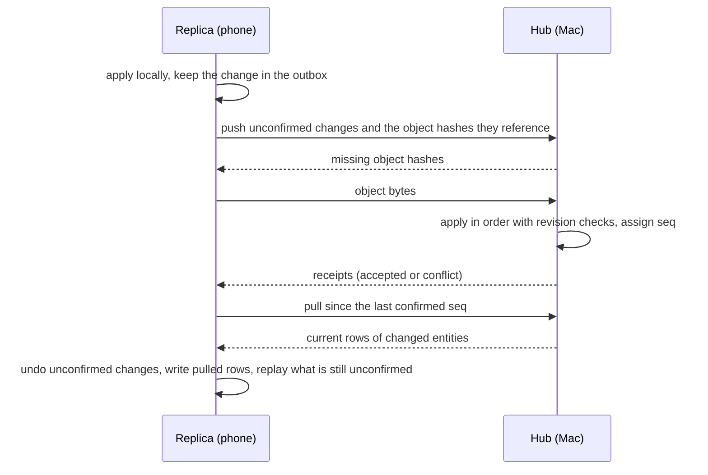

# Sync

Tessera syncs one person's notebook between devices they own: the Mac, the Android phone and later other machines on their tailnet. Collaboration and end-to-end encryption are not built. The rules below keep both possible without a rewrite.

## Shape

One notebook is the hub and puts every change in order. The others are replicas. A replica holds the whole outline and the library's text, fetches original book files when they are opened or pinned for offline reading, and keeps unconfirmed changes in a durable outbox.

The first hub is the Mac's service. The phone syncs while the Mac is awake and reachable on the tailnet. The hub is the same `tessera-service` binary, so it can move to an always-on machine later and the Mac becomes a replica.

This is the editor's existing outbox model with a durable replica behind it. Row-level merging (one last-writer-wins value per row) is ruled out because it breaks unique titles, journal dates, citation keys and the tree rules. A document CRDT is ruled out because it would make SQLite a materialized view and replace `tessera-core`.

## Protocol

- **Push.** A replica sends each unconfirmed change with its change ID, origin device, stamp time and batch. The hub applies it with `Notebook::apply_stamped`, so every rule in `tessera-core` still holds. A change ID the hub has already applied returns the stored receipt.
- **Objects.** A push lists the object hashes its changes reference. The hub asks for the ones it lacks, and the replica uploads them by hash. Pulls work the same way in reverse, except that a replica fetches a book's original file and images only when the book is opened or pinned.
- **Pull.** A replica asks for changes after its last confirmed seq (`Notebook::changes_since`). It writes the current rows of the changed entities and rebuilds derived data. It does not replay the hub's operations, so outcomes the hub decided, such as merges and conflicts, arrive as results.
- **Rebase.** A replica undoes its unconfirmed changes with their stored inverses, as agent undo already does, writes the pulled rows, then replays whatever is still unconfirmed against the new revisions.
- **Conflicts.** A stale operation fails at the hub without writing, as it does today. When the replica's text for a block is rejected, the replica keeps both versions and shows the existing conflict state. Inserts, highlights and new pages do not conflict.
- **Natural-key collisions.** Two devices can create the same thing offline. The hub resolves each collision the same way every time. Pages with the same title merge into the earlier one with `MergePage`, which redirects references. Journal days for the same date move their children into the earlier day; `MergePage` excludes journals, so this needs its own operation. A duplicate citation key gets a suffix.
- **Library content.** Snapshot rows, passages and resource lists travel as data and are never extracted again on the receiving device, so extractor changes between app builds cannot make devices disagree. Snapshot and passage IDs come from content (below). A snapshot imported before sync has a random ID; when a replica's snapshot has the same SHA-256 as one of the hub's, the hub keeps its own and moves the replica's citations by passage locator.
- **State outside the log.** Reading positions and highlight surfacings are written outside the change log. They sync as last-writer-wins rows ordered by a hybrid logical clock. Reading coverage merges as a union of ranges.
- **Sequence columns.** `review_events.change_seq`, `citations.created_seq` and the other `*_seq` columns hold local sequence numbers. A replica takes the hub's numbering for confirmed changes and renumbers its unconfirmed ones on rebase.

## Identity and determinism

Every device must reach the same state from the same changes, so applying a change depends only on the batch, its stamp and the current state.

- Each change has a global ID (a ULID) and an origin device, stored in `changes.change_id` and `changes.origin`. Its stamp time is `changes.created_at` and becomes every `created_at`/`updated_at` the change writes. `seq` stays the local order.
- Each notebook directory has a device ID in the `replica` table. Cloning a notebook for a new device must mint a new one; a backup restored on the same device keeps it.
- Clients choose the IDs of what they create (blocks, citations, sessions, events, views) and send them in operations, as they do now.
- IDs that `apply` itself creates are derived, never random:

| Created during apply | ID derived from |
|---|---|
| Deletion event | change ID, operation index, deleted block |
| Type page created by a tag | change ID, title key |
| Card unit | source block, card key (its unique identity) |
| Reset event recorded with a grade | the grade's event ID |

- Library content IDs come from content. A snapshot's ID derives from its SHA-256, which is already unique per snapshot. A passage's ID derives from its snapshot and its locator, which is unique within the snapshot.
- Writes at open time (the notebook row and the Fields page) happen before a notebook is cloned, and the clone copies them.

`replication::TABLES` in `tessera-core` classifies every table by how a replica gets it. A test fails when a migration adds a table without a class.

| Class | Tables | A replica gets them by |
|---|---|---|
| Identity | `notebook` | cloning |
| Applied | blocks, capabilities, the change log, views, settings, cards, review and work history | applying changes or pulling their rows |
| Derived | links, search and field indexes | rebuilding them locally |
| Content | snapshots, passages, snapshot resources, browser objects | fetching by content hash |
| Unlogged | reading positions, highlight surfacings | last-writer-wins rows |
| Local | the device ID, ingestion jobs, agent undo records | never; they stay on the device |

The `vim` setting describes a keyboard, not a notebook. It becomes local to the device before replicas exist; `time_zone` stays notebook-wide.

## Transport

Editor routes stay on loopback and keep rejecting other hosts and origins. Sync gets its own listener with only push, pull and object routes, published on the tailnet through Tailscale Serve, which supplies the TLS certificate and the caller's tailnet identity. Each device also holds a key enrolled by pairing with a QR code shown by the hub.

On Android, `reqwest`'s platform TLS verifier is not initialized. The sync client uses rustls with bundled roots, which accept the Let's Encrypt certificates Tailscale issues for `ts.net` names, or the app sets up the verifier, which would also enable article URLs.

A phone that already has its own notebook imports its phone-only content into the hub once, then clones from the hub. Two independent histories are never merged.

## Later: end-to-end encryption and collaboration

The hub reads changes only to validate them. Once applying a change is deterministic everywhere and a stale operation resolves to the same outcome on every device instead of being rejected, the hub can become a blind sequencer: it numbers and stores encrypted batches it cannot read, and every device decrypts and applies them in order. The notebook key would be wrapped once per device key. A shared subtree would be a second log with its own key and members.

Text edits replace a block's whole text. That is enough for one person's conflicts. Live collaboration would replace it with a text CRDT per block, so the block stays the unit of text and the outline model does not change.

## Stages

1. **Determinism and identity.** Done: change IDs and origins, a device ID, stamped apply, derived IDs inside apply, content-derived library IDs, table classes, and a test that two copies of a notebook reach identical state from the same changes.
2. **Replica protocol on loopback.** `tessera sync` between two notebook directories: clone with a new device ID, push, pull, rebase, conflicts and natural-key merges.
3. **Objects and library.** Fetching by hash, pinning books for offline reading, moving citations between duplicate snapshots, and last-writer-wins rows with a hybrid logical clock.
4. **Tailnet and Android.** The sync listener behind Tailscale Serve, pairing, and the Android client.

Exit test: offline, highlight a book on the phone while editing today's journal on the Mac; reconnect, and both devices show the highlights and the journal. When both edited the same block, both versions are shown.
